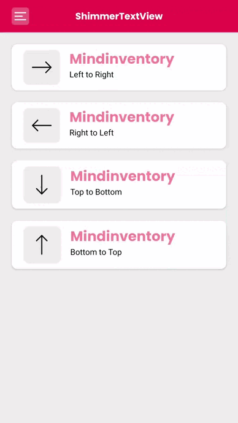

ShimmerTextView
====

ShimmerTextView is a simple library to integrate shimmer effect in your TextView.

# Key features

* Set a base color in ShimmerTextView.
* Set a highlight color in ShimmerTextView.
* Set animation duration for shimmer effect(in millisecond).
* Set animation direction(left_to_right, top_to_bottom, right_to_left, bottom_to_top).
* Set ShimmerTextView shape(Linear/Radial)

# Usage

**Dependencies**
> Insert gradle dependency here.

**Implementation**

* Step 1 : Use custom ShimmerTextView in XML.

        <com.app.shimmertextview.ShimmerTextView
            android:id="@+id/textView"
            android:layout_width="0dp"
            android:layout_height="wrap_content"
            android:text="@string/text_mi"
            android:textSize="24sp"
            app:layout_constraintEnd_toEndOf="parent"
            app:layout_constraintStart_toEndOf="@id/ivLeftToRight"
            app:layout_constraintTop_toTopOf="@id/ivLeftToRight"
            app:layout_constraintBottom_toTopOf="@id/tvLeftToRight"
            app:shimmer_base_color="@color/dark_red"
            app:shimmer_colored="true"
            app:shimmer_highlight_color="@color/orange"
            android:fontFamily="@font/poppins_bold"
            app:shimmer_duration="3000"
            android:layout_marginHorizontal="16dp"
            android:includeFontPadding="false"/>

* Step 2 : Use all attributes dynamically in your.

        class MainActivity : AppCompatActivity() {
            override fun onCreate(savedInstanceState: Bundle?) {
                super.onCreate(savedInstanceState)
                setContentView(R.layout.activity_main)
                        
                val textView = findViewById<ShimmerTextView>(R.id.textView)
                textView.setBaseColor(ContextCompat.getColor(this, R.color.dark_red))
                .setHighLightColor(ContextCompat.getColor(this, R.color.orange))
                .setDirection(Shimmer.Direction.LEFT_TO_RIGHT)
                .build()
                textView.startShimmer()
            }
        }

**XML Properties**

| Properties             | Description                               |
|------------------------|-------------------------------------------|
|shimmer_base_color      |Set base color of ShimmerTextView          |
|Shimmer_highlight_color |Set highlight color of shimmer animation   |
|shimmer_colored         |Set it to true for colored ShimmerTextView |
|shimmer_duration        |Set duration for animation                 |
|shimmer_direction       |Set animation direction(left_to_right,top_to_bottom, right_to_left, bottom_to_top)|

That's it 👍 and you're good to go 🚀

### Guideline to report an issue/feature request
---------
It would be very helpful for us, if the reporter can share the below things to understand the root cause of the issue.

* Library version.
* Code snippet.
* Logs if applicable.
* Screenshot/video with steps to reproduce the issue.

### LICENCE
----------------
ShimmerTextView is [MIT-licensed.](https://git.mindinventory.com/mi-android/android-libs/shimmertextview/-/blob/master/LICENSE)

### Let us know!
---------
If you use open-source libraries in your project, please make sure to credit us and Give a star to [www.mindinventory.com](https://www.mindinventory.com/)

Please feel free to use this component and let us know if you are interested to building Apps or Designing Products.
